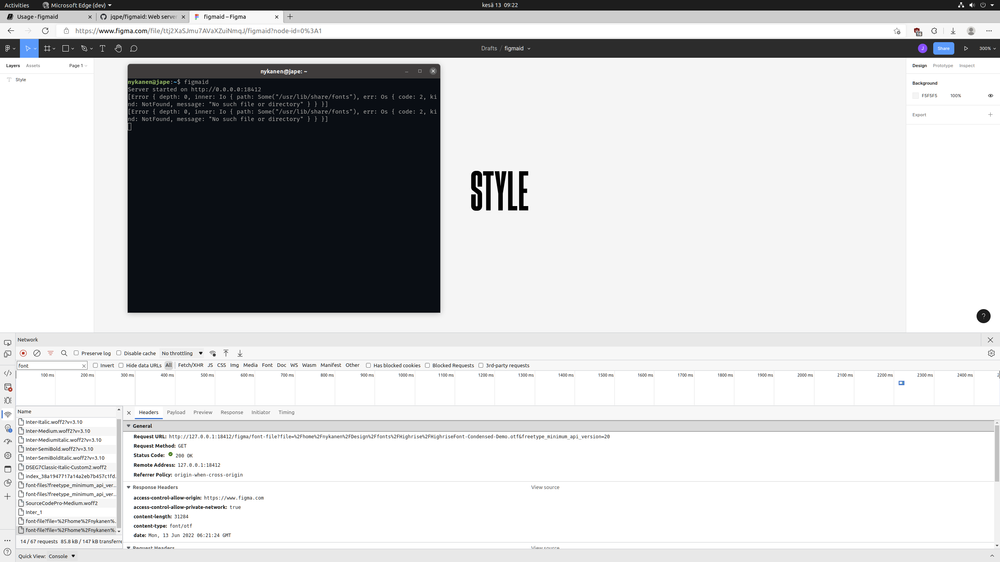

# Introduction

Figmaid is a simple web server that serves locally installed files to Figma.

## How does it work?

1. **Figma sends a request to http://localhost:18412/figma/font-files.**
<figure>

<figcaption>The server is not running at this point.</figcaption>
</figure>

2. **Start the server and reload the page. Figma will now use fonts served by figmaid.**

3. **Individual font files are requested from the server.**
