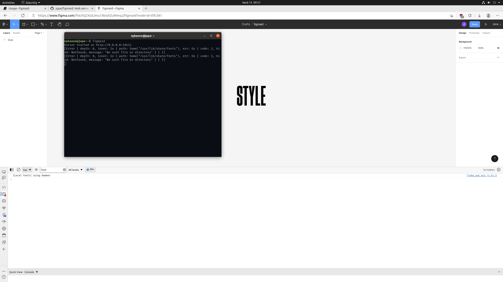
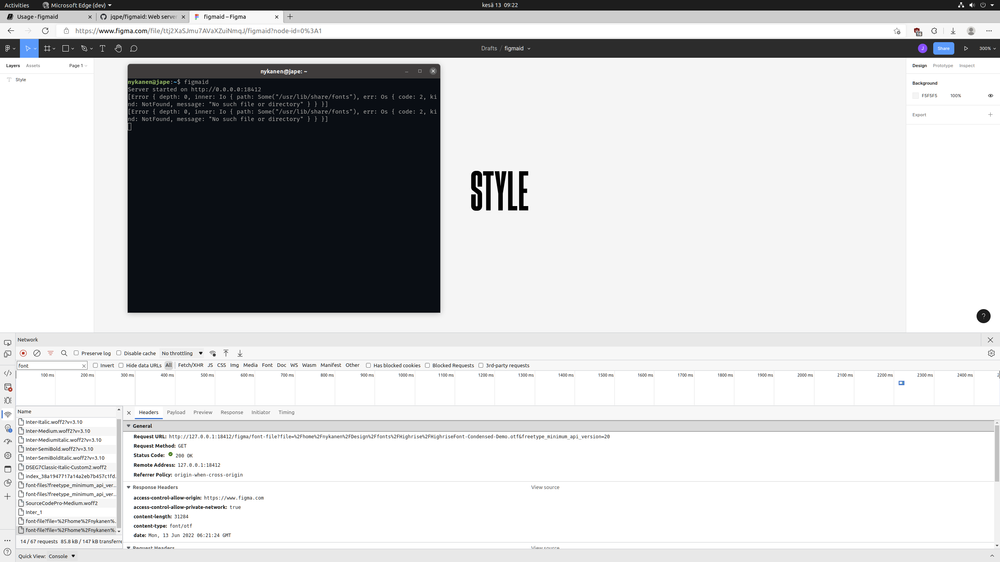

# Introduction

Figmaid is a simple web server that serves locally installed files to Figma.

## How does it work?

1. Start the server and reload Figma, if open. Figma will now use fonts served by figmaid.

2. Individual font files are requested from the server.
